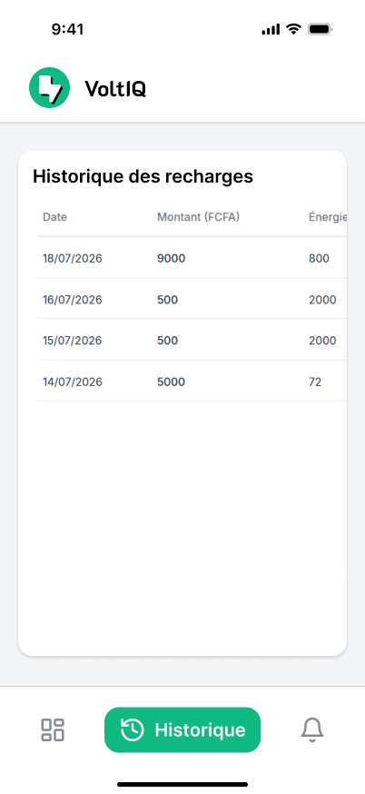
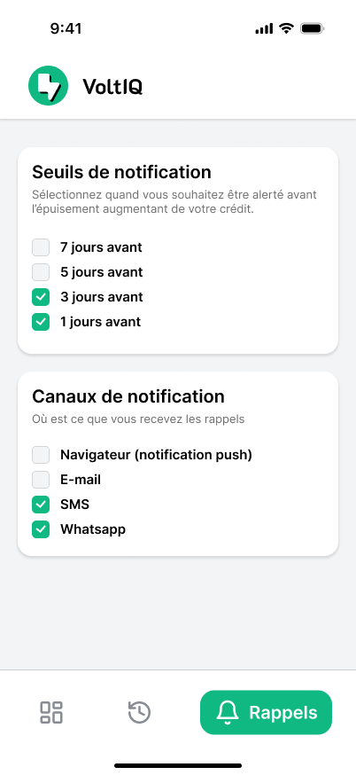

<div align="center">
  
  
  # VoltIQ - Maîtrisez votre énergie ⚡

  **VoltIQ** est une application mobile-first élégante et 100% autonome conçue pour vous aider à comprendre, suivre et optimiser la consommation de votre compteur prépayé, jour après jour.

  [](https://reactjs.org/)
  [](https://vitejs.dev/)
  [](https://developer.mozilla.org/fr/docs/Web/CSS)
</div>

---
<div align="center">
## 🌟 Aperçu du Design
<div align="center">
L'interface de VoltIQ a été pensée pour être claire, moderne et parfaitement adaptée aux mobiles.

<div align="center">
  
  
  
</div>

## ✨ Fonctionnalités Clés

- 🔋 **Suivi en temps réel** : Visualisez instantanément l'énergie restante et l'estimation de sa durée.
- 📊 **Analyse de consommation** : Un graphique interactif vous permet de suivre votre consommation moyenne au fil du temps.
- 📖 **Historique complet** : Retrouvez la liste complète de toutes vos recharges avec les montants (FCFA) et l'énergie ajoutée.
- 🔔 **Rappels personnalisables** : Configurez des alertes (7 jours, 5 jours, etc.) pour ne plus jamais être coupé par surprise.
- 🚀 **100% Local & Hors-ligne** : Vos données vous appartiennent. L'application stocke tout directement dans votre navigateur. Aucun backend ni base de données ne ralentit l'application !

## 🛠️ Architecture Technique

Cette application a été construite pour être rapide et fiable. Elle repose sur :
- **React.js** (via Vite) pour une navigation fluide et instantanée (Single Page Application).
- **Vanilla CSS** pour un design sur mesure parfait, des animations fluides et des variables de thème robustes.
- **LocalStorage API** en tant que base de données, permettant un fonctionnement hors-ligne total.

## 🚀 Installation & Lancement en local

1. **Cloner le projet**
   ```bash
   git clone https://github.com/VOTRE_PSEUDO/VoltIQ.git
   cd VoltIQ
   ```

2. **Installer les dépendances**
   ```bash
   npm install
   ```

3. **Lancer le serveur de développement**
   ```bash
   npm run dev
   ```

L'application sera accessible sur `http://localhost:5173`. Ouvrez ce lien sur votre navigateur (de préférence en simulant une vue mobile depuis les outils de développement pour la meilleure expérience).

## 🌍 Déploiement

Ce projet est prêt à être hébergé sur **Vercel**, **Netlify**, ou **GitHub Pages**. Il s'agit d'un site statique pur, ce qui signifie que vous pouvez l'importer directement depuis GitHub sur Vercel et le déployer en **un clic** sans aucune configuration supplémentaire !

---
<div align="center">
  <p>Conçu avec ❤️ pour une gestion énergétique intelligente.</p>
</div>
